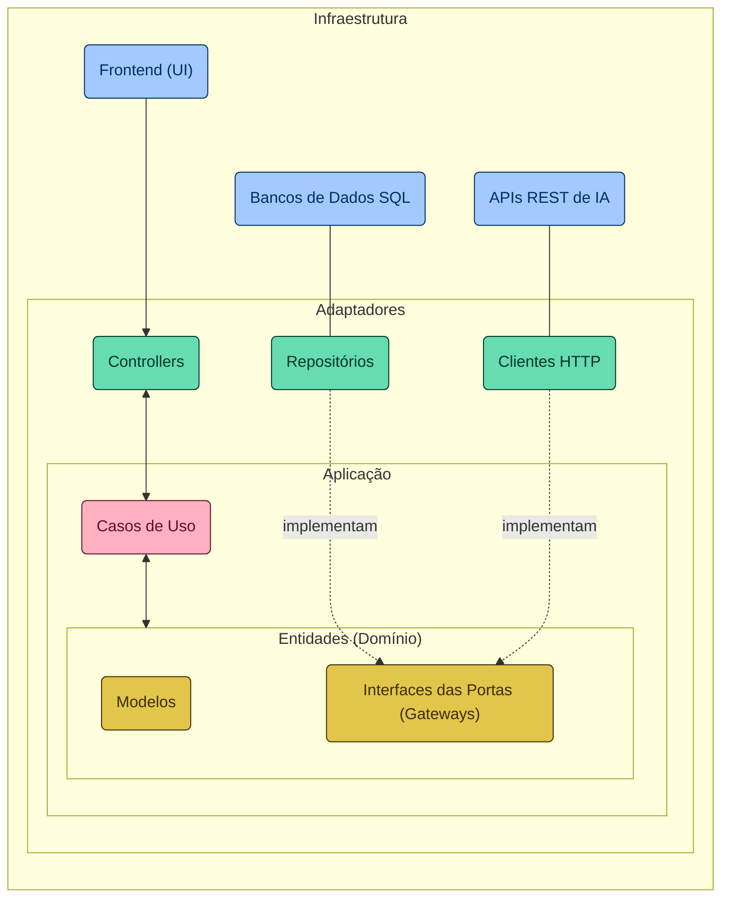
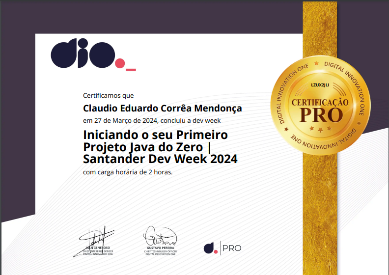
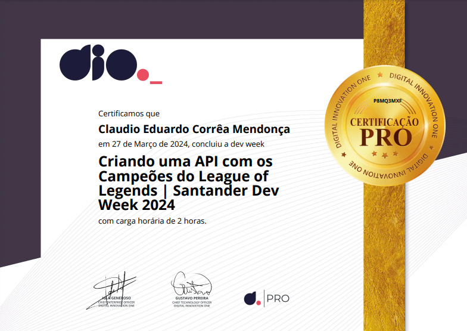
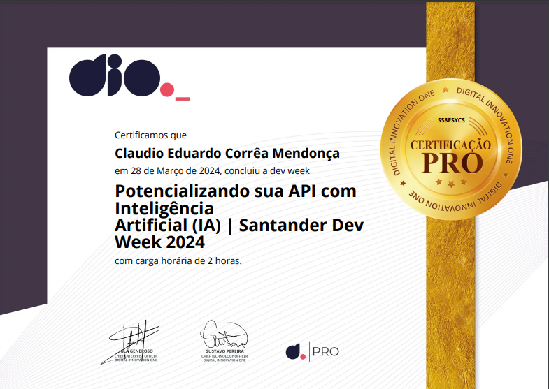
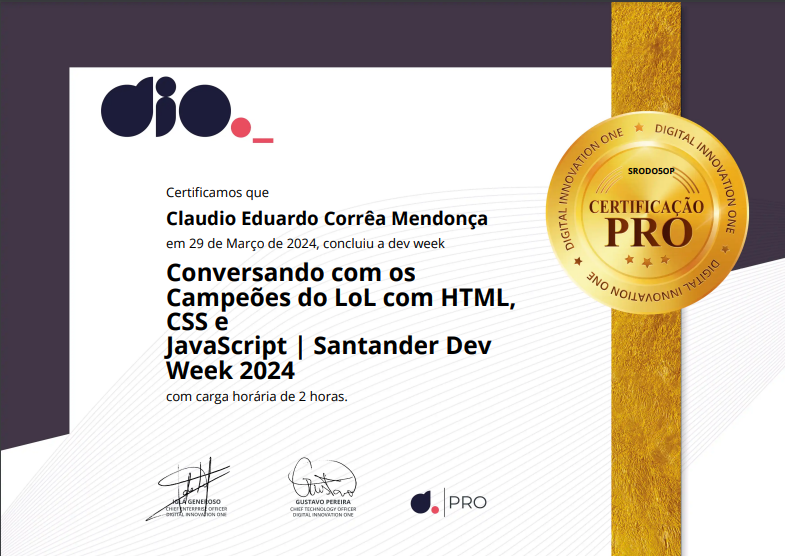

# Santander Dev Week 2024
|  |
|:---:|
| Participei do Santander Dev Week online! Aprendi a criar um Chat Inteligente com os Campeões de LOL usando APIs, Java, Spring Boot, IA e Páginas Web. Ganhei habilidades fullstack com aulas práticas e aumentei minhas chances de contratação.|
|  |
| [](https://claudiomendonca-eng.github.io/santander-dev-week-26-03-24/) |


<a href="https://docs.oracle.com/en/java/javase/20/"></a>
<a href="https://developer.mozilla.org/docs/Web/HTML"></a>
  <a href="https://developer.mozilla.org/docs/Web/CSS"></a>
  <a href="https://www.javascript.com/"></a>
  <a href="https://www.python.org/"></a>

## Link do Projeto
- [Chat com os Campeões do LOL](https://claudiomendonca-eng.github.io/santander-dev-week-26-03-24/)

## Índice
<a id="topo"></a>

- [Sobre o Projeto](#sobre-o-projeto)
- [Instrutores](#instrutor)
- [Pré-Requisitos](#pré-requisitos)
- [Agenda das Lives](#agenda-das-lives)
- [Como Participar dos Bootcamps Santander 2024](#como-participar-dos-bootcamps-santander-2024)
- [Arquitetura do Projeto](#arquitetura-do-projeto)
  - [Diagrama Arquitetural](#diagrama-arquitetural)
  - [Estrutura de Diretórios](#estrutura-de-diretórios)
  - [Banco de Dados SQL em Memória](#banco-de-dados-sql-em-memória)
<!-- - [Contribuições](#contribuições) -->
- [Na Prática](#na-prática)
    - [Iniciando o seu Primeiro Projeto Java do Zero](#iniciando-o-seu-primeiro-projeto-java-do-zero)
    - [Criando uma API com os Campeões do League of Legends](#criando-uma-api-com-os-campeões-do-league-of-legends)
    - [Potencializando sua API com Inteligência Artificial (IA)](#potencializando-sua-api-com-inteligência-artificial-ia)
    - [Conversando com os Campeões do LoL com HTML, CSS e JavaScript](#conversando-com-os-campeões-do-lol-com-html-css-e-javascript)
- [Considerações Finais](#considerações-finais)
- [Certificados](#certificados)
- [Licença](#licença)


## <a name="sobre-o-projeto"></a>Sobre o Projeto

Neste repositório, você encontrará o código-fonte de uma REST API e seu respectivo Frontend (pasta `/docs`), desenvolvidos durante a Santander Dev Week 2024, fruto de uma colaboração entre a DIO e o Santander. Este projeto, construído com Java 21 e Spring Boot 3, é o resultado de quatro dias de lives, com um propósito incrível:

> [!NOTE]
> Objetivo: "Permitir que os usuários conversem com os campeões do League of Legends (LOL)".

Para isso, utilizamos algumas das mais recentes Inteligências Artificiais (IAs) Generativas, possibilitando que nossa API "entenda" a personalidade única de cada campeão para criar interações que capturam sua essência, tornando cada conversa uma experiência única.

<p align="right">
  <a href="#topo" style="text-decoration: none; background-color: #007bff; color: white; padding: 10px 20px; border-radius: 5px;">Voltar ao Topo</a>
</p>

## <a name="instrutor"> Instrutores </a>

- [Venilton FalvoJr](https://github.com/falvojr) - Doutorando no ICMC-USP, onde contribui junto ao CAEd. Atualmente é Tech Lead na DIO (dio.me), uma edtech que visa democratizar o ensino e capacitação em TI.

- [Felipe Silva Aguiar](https://github.com/felipeAguiarCode) - Desenvolvedor de Software na DIO (Digital Innovation One), com experiência em desenvolvimento de aplicações web e mobile.Software Consultant developer 🚀 10+ Anos desenvolvendo aplicações Web.

## <a name="pré-requisitos"></a>Pré-Requisitos

> [!TIP]
> Caso queira reproduzir este projeto, você terá os seguintes pré-requisitos:
> - Vontade de Aprender 😉
> - Instalação da **[JDK 21](https://www.oracle.com/br/java/technologies/downloads/#java21)** (versão LTS do Java na data das lives);
> - Instalação do **[IntelliJ IDEA Community Edition](https://www.jetbrains.com/idea/download)** ou a IDE de sua preferência (Eclipse, VSCode etc);
> - [Opcional] Conta na AWS (caso queira publicar a sua API REST na Nuvem usando o [AWS Elastic Beanstalk](https://aws.amazon.com/elasticbeanstalk);
> - [Opcional] Conta na OpenAI e/ou Google para integração com os modelos [GPT](https://platform.openai.com/docs/api-reference/chat/create) e/ou [Gemini](https://ai.google.dev/tutorials/rest_quickstart#text-only_input) respectivamente.
>
> _Nossa querida a Aline Antunes ([@alinealien](https://github.com/alinealien)), gravou dois tutoriais rápidos para quem está com dificuldades na instalação da [JDK 21](https://www.youtube.com/watch?v=3TLv67ihDvo) e [IntelliJ](https://www.youtube.com/watch?v=3TLv67ihDvo). Muito obrigado Aline_ 👊😀


<p align="right">
  <a href="#topo" style="text-decoration: none; background-color: #007bff; color: white; padding: 10px 20px; border-radius: 5px;">Voltar ao Topo</a>
</p>

## <a name="agenda-das-lives"></a>Agenda das Lives

1. **[Iniciando o seu Primeiro Projeto Java do Zero](https://web.dio.me/lives/iniciando-o-seu-primeiro-projeto-java-do-zero-santander-dev-week-2024)** | 25/03 às 19h: 
Fundamentos da linguagem de programação Java e configurações de projetos Spring Boot. Foco em Programação Orientada a Objetos e sua relação com Bancos de Dados SQL através do Spring Data JDBC.
2. **[Criando uma API com os Campeões do League of Legends](https://web.dio.me/lives/criando-uma-api-com-os-campeoes-do-league-of-legends-santander-dev-week-2024)** | 26/03 às 19h:
Criação de uma API REST, abordando design, desenvolvimento e documentação, com foco em campeões do League of Legends. Publicação da API no AWS Elastic Beanstalk.
3. **[Potencializando sua API com Inteligência Artificial (IA)](https://web.dio.me/lives/potencializando-sua-api-com-inteligencia-artificial-ia-santander-dev-week-2024)** | 27/03 às 19h: 
Incorporação de IA para otimizar a API, utilizando o Spring Cloud OpenFeign para integração com APIs de IA de grandes provedores, como OpenAI (GPT) e Google (Gemini).
4. **[Conversando com os Campeões do LoL com HTML, CSS e JavaScript](https://web.dio.me/lives/conversando-com-os-campeoes-do-lol-com-html-css-e-javascript-santander-dev-week-2024)** | 28/03 às 19h:
Construção da interface do usuário, interatividade e integração com a API explorando os fundamentos de HTML, CSS e JavaScript.
    - Material Complementar Desta Live no [Notion do Felipão](https://helpful-jump-17b.notion.site/Santander-Dev-Week-24-Integra-o-945ebd16b5e3462a9561b6beb6d7587d?pvs=4) 📰

_Passo a passo para gerar seus **CERTIFICADOS** na plataforma da DIO:_
- _Ao acessar a live pelo link, basta clicar no botão "Concluir atividade";_
- _Depois, é só clicar na sua foto de perfil e selecionar a opção "Certificados";_
- _Pronto! Agora é só baixar seus certificados e compartilhar conosco seu feedback!_

## <a name="como-participar-dos-bootcamps-santander-2024"></a>Como Participar dos Bootcamps Santander 2024

> [!IMPORTANT] 
> ## ♨️ Como Participar dos Bootcamps Santander 2024
>
> Ainda não garantiu a sua vaga? **Inscreva-se até 08/04/2024 nos [Bootcamps Santander 2024](https://bit.ly/48S4DCy)** para uma experiência educacional completa, explorando em detalhes os temas praticados durante a imersão da Santander Dev Week 2024. Nesse sentido, as opções de Bootcamps Santander disponíveis para matrícula na plataforma da DIO são:
> 
> 1. [Backend com Java e Spring Boot](https://web.dio.me/track/santander-2024-backend-com-java)
> 2. [Certificação AWS Cloud Practitioner (CLF-C02)](https://web.dio.me/track/santander-2024-preparatorio-certificacao-aws)
> 3. [Desenvolvimento de Jogos com Godot](https://web.dio.me/track/santander-2024-criando-jogos-com-godot) 
> 4. [Fundamentos de IA Para Devs](https://web.dio.me/track/santander-2024-fundamentos-de-ia-para-devs) 


<p align="right">
  <a href="#topo" style="text-decoration: none; background-color: #007bff; color: white; padding: 10px 20px; border-radius: 5px;">Voltar ao Topo</a>
</p>

## <a name="arquitetura-do-projeto"></a>Arquitetura do Projeto

### <a name="diagrama-arquitetural"></a>Diagrama Arquitetural
A seguir, apresentamos o diagrama arquitetural do projeto (escrito com [Mermaid](https://mermaid.js.org/)), destacando a separação das responsabilidades entre as camadas. Desde a interface de usuário até os mecanismos de interação com sistemas externos, passando por adaptadores, casos de uso e as entidades centrais do domínio, cada elemento é estrategicamente posicionado para reforçar a modularidade, a escalabilidade e a manutenibilidade do sistema. Esta estrutura facilita a compreensão de como os componentes colaboram para a realização dos objetivos do software, alinhando-se aos princípios da [Clean Architecture](https://blog.cleancoder.com/uncle-bob/2012/08/13/the-clean-architecture.html) (inclusive nas cores dos elementos).




<p align="right">
  <a href="#topo" style="text-decoration: none; background-color: #007bff; color: white; padding: 10px 20px; border-radius: 5px;">Voltar ao Topo</a>
</p>

### <a name="estrutura-de-diretórios"></a>Estrutura de Diretórios

Refletindo a organização apresentada no diagrama arquitetural, a estrutura de diretórios do projeto sugere uma Clean Architecture simplificada, visando a uma clara separação das responsabilidades e promovendo a autonomia das camadas em um projeto Spring Boot. Esta abordagem estrutural não só facilita a manutenção e a evolução do código, mas também sustenta a integração e a colaboração eficaz entre as diferentes partes da aplicação. A seguir, detalhamos a disposição dos diretórios que compõem a aplicação, cada um desempenhando um papel específico dentro do ecossistema de software:

-   `adapters/`: Inclui os adaptadores que facilitam a comunicação entre a aplicação e o mundo externo (único diretório que "conhece" o Spring).
    -   `in/`: Abriga os adaptadores de entrada, tais como controladores REST, que lidam com as requisições dos usuários.
    -   `out/`: Contém os adaptadores de saída, responsáveis da interação com bancos de dados e APIs externas, por exemplo.
-   `application/`: Hospeda os casos de uso da aplicação, encapsulando a lógica de negócios essencial.
-   `domain/`: Representa o coração da aplicação, englobando entidades, exceções e interfaces (portas) que articulam as regras de negócio fundamentais.
    -   `exception/`: Define as exceções personalizadas pertinentes ao domínio.
    -   `model/`: Modela as entidades do domínio, refletindo os conceitos centrais da aplicação.
    -   `ports/`: Estabelece as interfaces que delineiam os contratos para os adaptadores e serviços externos.
-   `Application.java`: A classe principal que orquestra a configuração e o execução da aplicação.


<p align="right">
  <a href="#topo" style="text-decoration: none; background-color: #007bff; color: white; padding: 10px 20px; border-radius: 5px;">Voltar ao Topo</a>
</p>

### <a name="banco-de-dados-sql-em-memória"></a>Banco de Dados SQL em Memória

A utilização do banco de dados H2 neste projeto serve como uma fundação ágil e flexível para modelar nosso domínio de conhecimento — os campeões do LOL. Essa escolha permite uma rápida prototipação e um ambiente de desenvolvimento eficiente, essencial para armazenar e recuperar informações detalhadas sobre cada campeão. Dessa forma, garantimos que as IAs Generativas que integramos possam acessar um repositório rico e detalhado, permitindo-lhes capturar com precisão a essência e a personalidade única de cada campeão, enriquecendo assim a interatividade e a profundidade das interações realizadas.

```sql
CREATE TABLE IF NOT EXISTS champions (
    id INT AUTO_INCREMENT PRIMARY KEY,
    name VARCHAR(255) NOT NULL,
    role VARCHAR(255) NOT NULL,
    lore TEXT,
    image_url VARCHAR(255)
);

INSERT INTO champions (name, role, lore, image_url) VALUES
    ('Jinx', 'Atirador', 'Uma criminosa impulsiva e maníaca de Zaun, Jinx vive para disseminar o caos sem se preocupar com as consequências. Com um arsenal de armas mortais, ela detona as explosões mais altas e mais luminosas para deixar um rastro de destruição e pânico por onde passa. Jinx abomina o tédio e deixa alegremente sua marca caótica de pandemônio aonde quer que vá.', 'https://ddragon.leagueoflegends.com/cdn/img/champion/splash/Jinx_0.jpg'),
    ('Vi', 'Lutador', 'Antiga criminosa das ruas violentas de Zaun, Vi é uma mulher temível, impulsiva e explosiva que tem muito pouco respeito por autoridades. Após ter crescido completamente só, Vi desenvolveu instintos de sobrevivência extremamente certeiros e um senso de humor extremamente ácido. Agora trabalhando com os Vigias de Piltover para manter a paz, ela porta poderosas manoplas hextec capazes de esmagar paredes e suspeitos com a mesma facilidade.', 'https://ddragon.leagueoflegends.com/cdn/img/champion/splash/Vi_0.jpg'),
    ('Ekko', 'Assassino', 'Um prodígio das ruas violentas de Zaun, Ekko manipula o tempo para reverter qualquer situação a seu favor. Usando sua própria invenção, o Revo-Z, ele explora as possíveis bifurcações da realidade para criar o momento perfeito. Embora valorize muito sua liberdade, quando algo ameaça seus amigos, ele não mede esforços para defendê-los. Para meros observadores, Ekko parece conseguir o impossível sempre de primeira.', 'https://ddragon.leagueoflegends.com/cdn/img/champion/splash/Ekko_0.jpg'),
    ('Caitlyn', 'Atirador', 'Conhecida como sua melhor pacificadora, Caitlyn também é a melhor escolha de Piltover para livrar a cidade de seus elementos criminosos elusivos. É comum que ela faça dupla com Vi, agindo como um contraponto de calmaria para a natureza impetuosa de sua parceira. Mesmo carregando um rifle hextec único, a arma mais poderosa de Caitlyn é seu intelecto superior, que permite que ela prepare elaboradas armadilhas para qualquer fora da lei tolo o suficiente para operar na Cidade do Progresso.', 'https://ddragon.leagueoflegends.com/cdn/img/champion/splash/Caitlyn_0.jpg'),
    ('Jayce', 'Lutador', 'Jayce é um brilhante inventor que dedicou sua vida a defender Piltover e sua implacável busca pelo progresso. Com seu martelo hextech transformador em mãos, Jayce usa sua força, coragem e considerável inteligência para proteger sua cidade natal. Embora seja aclamado pela cidade como herói, ele não gosta muito da atenção que o heroísmo traz. Mesmo assim, o coração de Jayce está no lugar certo e até aqueles que invejam suas habilidades naturais são gratos à forma como ele protege a Cidade do Progresso.', 'https://ddragon.leagueoflegends.com/cdn/img/champion/splash/Jayce_0.jpg'),
    ('Viktor', 'Mago', 'Viktor, o arauto de uma nova era de tecnologia, devotou sua vida ao avanço da humanidade. Um idealista que busca elevar o povo de Zaun a um novo nível de compreensão, ele acredita que somente ao aceitar a evolução gloriosa da tecnologia será possível que a humanidade alcance seu verdadeiro potencial. Com um corpo melhorado por aço e ciência, Viktor é zeloso na sua busca por este brilhante futuro.', 'https://ddragon.leagueoflegends.com/cdn/img/champion/splash/Viktor_0.jpg'),
    ('Heimerdinger', 'Mago', 'Um cientista brilhante, mesmo que excêntrico, o Professor Cecil B. Heimerdinger é um dos inventores mais inovadores e estimados que Piltover já conheceu. Incansável em seu trabalho ao ponto da obsessão neurótica, ele busca responder as questões mais impenetráveis do universo. Apesar de suas teorias frequentemente parecerem obscuras e esotéricas, Heimerdinger produziu algumas das máquinas mais miraculosas, sem mencionar letais, de Piltover e ajusta constantemente suas invenções para torná-las ainda mais eficientes.', 'https://ddragon.leagueoflegends.com/cdn/img/champion/splash/Heimerdinger_0.jpg'),
    ('Singed', 'Tanque', 'Singed é um alquimista zaunita de intelecto inigualável, que devotou sua vida a ultrapassar os limites do conhecimento; e nenhum preço, nem sua própria sanidade, é alto demais. Existe cura para sua loucura? Suas misturas raramente falham, mas, para muitos, Singed perdeu qualquer noção da humanidade, deixando uma trilha tóxica de miséria e terror no seu caminho.', 'https://ddragon.leagueoflegends.com/cdn/img/champion/splash/Singed_0.jpg'),
    ('Ryze', 'Mago', 'Considerado pela grande maioria como o mago mais habilidoso de Runeterra, Ryze é um arquimago ancião e amargo que carrega um enorme peso. Dotado de um enorme poder arcano e de uma notável estrutura física, ele busca incansavelmente pelas Runas Globais, que são fragmentos de magia pura que um dia criaram o mundo a partir do nada. Ele deve recuperar esses artefatos antes que eles caiam em mãos erradas, pois Ryze conhece bem os horrores que eles podem infligir em Runeterra.', 'https://ddragon.leagueoflegends.com/cdn/img/champion/splash/Ryze_0.jpg'),
    ('Master Yi', 'Assassino', 'Master Yi treinou seu corpo e afiou sua mente para que pensamento e ação se tornassem quase um só. Embora ele prefira recorrer à violência como último recurso, a leveza e a velocidade de sua espada garantem uma resolução sempre veloz. Como um dos últimos praticantes da arte ioniana do Wuju, Yi dedicou sua vida a preservar o legado de seu povo, avaliando potenciais discípulos com as Sete Lentes da Perspicácia para identificar qual deles era o mais digno.', 'https://ddragon.leagueoflegends.com/cdn/img/champion/splash/MasterYi_0.jpg'),
    ('Garen', 'Lutador', 'Um guerreiro nobre e orgulhoso, Garen faz parte da Vanguarda Destemida. Popular entre seus companheiros e respeitado o suficiente por seus inimigos, sua reputação é nada mais do que o esperado de um herdeiro da prestigiosa família Stemmaguarda, encarregada de defender Demacia e seus ideais. Vestido com uma armadura resistente à magia e empunhando uma poderosa espada, Garen está sempre pronto para confrontar magos e feiticeiros no campo de batalha, em um verdadeiro furacão de aço virtuoso.', 'https://ddragon.leagueoflegends.com/cdn/img/champion/splash/Garen_0.jpg'),
    ('Teemo', 'Atirador', 'Indiferente até aos obstáculos mais perigosos e ameaçadores, Teemo vasculha o mundo com infinito entusiasmo e animação. Um yordle com uma inabalável moral que se orgulha de seguir o Código dos Escoteiros de Bandópolis, às vezes com tanta dedicação que não se toca das possíveis consequências de suas ações. Embora alguns duvidem da existência dos escoteiros, uma coisa é certa: nunca se deve duvidar das convicções de Teemo.', 'https://ddragon.leagueoflegends.com/cdn/img/champion/splash/Teemo_0.jpg');
```
<p align="right">
  <a href="#topo" style="text-decoration: none; background-color: #007bff; color: white; padding: 10px 20px; border-radius: 5px;">Voltar ao Topo</a>
</p>

<!-- ## <a name="contribuições"></a>Contribuições

Contribuições são sempre bem-vindas! Veja como você pode contribuir:

1. Faça um fork do projeto.
2. Crie uma nova branch com suas modificações: `git checkout -b minha-nova-feature`.
3. Faça commit das suas alterações: `git commit -am 'Adicionando uma nova feature'`.
4. Push para a branch: `git push origin minha-nova-feature`.
5. Envie um pull request.

<p align="right">
  <a href="#topo" style="text-decoration: none; background-color: #007bff; color: white; padding: 10px 20px; border-radius: 5px;">Voltar ao Topo</a>
</p> -->

## <a name="na-prática"></a>Na Prática

### <a name="iniciando-o-seu-primeiro-projeto-java-do-zero"></a>Iniciando o seu Primeiro Projeto Java do Zero

Durante a Dev Week 2024, em parceria com o Santander, tive a oportunidade de participar de um curso introdutório sobre desenvolvimento de software, com foco em Java para backend. Logo no primeiro dia, fomos introduzidos ao Spring Initializr, uma ferramenta fundamental para iniciar projetos Java com Spring Boot, o que facilitou significativamente o processo de configuração do projeto.

Ao longo do curso, exploramos diversos tópicos importantes, como Clean Architecture, Design de Sistema e integração com APIs externas. Aprendi a estruturar meu projeto de forma clara, separando as camadas de Controller, Casos de Uso e Domínio, e aplicando os princípios da Clean Architecture para manter uma arquitetura limpa e desacoplada.

Uma das partes mais empolgantes foi a implementação da camada de persistência, onde aprendi a configurar o banco de dados, criar modelos de dados e implementar a interface de repositório para manipular os dados do banco. Utilizamos o Spring JDBC Template para executar consultas SQL de forma eficiente e mapear os resultados para objetos Java.

Além disso, desenvolvemos casos de uso para interagir com a camada de persistência, garantindo que nossa aplicação fosse independente da tecnologia específica de persistência de dados. Foi muito gratificante ver como todas as partes do projeto se comunicavam de forma eficiente, seguindo uma abordagem clara e organizada.

Ao longo da semana, continuaremos a desenvolver nosso projeto, explorando temas como a publicação da API na AWS, integração com inteligência artificial e desenvolvimento do frontend. Estou animado para aplicar o que aprendi e continuar minha jornada de aprendizado e evolução como desenvolvedor de software.

<p align="right">
  <a href="#topo" style="text-decoration: none; background-color: #007bff; color: white; padding: 10px 20px; border-radius: 5px;">Voltar ao Topo</a>
</p>


### <a name="criando-uma-api-com-os-campeões-do-league-of-legends"></a>Criando uma API com os Campeões do League of Legends

Olá pessoal! Hoje estou animado para compartilhar com vocês um pouco da minha experiência durante a Dev Week 2024 em parceria com o Santander. No segundo dia do curso, mergulhamos ainda mais no desenvolvimento da nossa API e aprendemos algumas práticas essenciais.

Começamos o dia relembrando o que fizemos no primeiro dia, onde nos dedicamos à modelagem da classe principal da nossa aplicação. Foi interessante ver como os atributos foram estruturados e como eles se relacionam com o banco de dados.

Um dos pontos altos do dia foi aprender sobre a arquitetura Clean. Descobri como os modelos não apenas armazenam dados, mas também possuem operações e regras de negócio. Isso foi uma revelação para mim, pois expandiu minha compreensão sobre a estruturação de aplicações.

A parte prática foi incrível! Utilizei o VS Code para criar um adaptador de entrada para nossa API, o que nos permitiu lidar com requisições HTTP de forma eficiente. Implementamos um novo Rest Controller e aprendi como injetar casos de uso para garantir uma separação clara de responsabilidades.

Além disso, aprendi sobre o uso de Records no Java e como eles simplificam a criação de controladores no Spring Boot. Essa foi uma técnica nova para mim, mas que facilitou muito o desenvolvimento.

No final do dia, mergulhamos na implantação da nossa aplicação na nuvem usando o Elastic Beanstalk da AWS. Foi uma experiência emocionante ver nossa API ganhando vida na nuvem e estar pronta para ser [acessada por usuários em todo o mundo](http://sdw24.sa-east-1.elasticbeanstalk.com/swagger-ui/index.html#/Campe%C3%B5es/askChampion). [E para o acesso local](http://127.0.0.1:8080/swagger-ui.html).

Em resumo, o segundo dia do curso foi repleto de aprendizado e práticas valiosas. Estou ansioso para aplicar esses novos conhecimentos em meus projetos futuros e continuar explorando o mundo do desenvolvimento de APIs. Até a próxima aula!

<p align="right">
  <a href="#topo" style="text-decoration: none; background-color: #007bff; color: white; padding: 10px 20px; border-radius: 5px;">Voltar ao Topo</a>
</p>


### <a name="potencializando-sua-api-com-inteligência-artificial-ia"></a>Potencializando sua API com Inteligência Artificial (IA)

Olá pessoal! Quero compartilhar um pouco da minha jornada durante o curso de Desenvolvimento de Integrações de IA em Java, especialmente focando no terceiro dia, onde finalizamos a configuração do Elastic Beanstalk para colocar nossa API na AWS.

Nos primeiros dias do curso, mergulhamos na modelagem das entidades do sistema, alinhando-as com as tabelas do banco de dados e aprendendo sobre o mapeamento objeto-relacional (ORM) com Java. Com isso, compreendi a importância de nossos modelos não apenas representarem os dados, mas também fornecerem informações relevantes para o contexto do negócio.

No segundo dia, concentramo-nos na exposição desses dados através de controladores REST, criando endpoints para interagir com os campeões do sistema.

No terceiro dia, avançamos para configurar as requisições HTTP para consumir a API generativa, como a OpenAI. Aprendi a definir adequadamente as requisições, escolher o modelo correto, configurar o prompt e adicionar autenticação para acessar a API. Com isso, conseguimos fazer requisições à API e interpretar as respostas, enriquecendo nossa aplicação com funcionalidades de IA.

Além disso, começamos a explorar a integração com uma API externa, especificamente o Google Gemini. Conhecemos a documentação, configuramos o ambiente para acessar a API e implementamos as classes de solicitação e resposta.

Durante todo o curso, utilizei a IDE VSCODE, o que facilitou muito meu trabalho, oferecendo recursos robustos para o desenvolvimento.

No final, após configurar corretamente as requisições HTTP e finalizar a integração com os serviços de IA, aprendi a implantar nossa API na AWS usando o Elastic Beanstalk. Esse processo envolveu a preparação do ambiente, a configuração das variáveis de ambiente e o monitoramento do processo de implantação.

Essa jornada de aprendizado foi incrivelmente enriquecedora. Agora me sinto confiante não apenas em desenvolver APIs eficientes em Java, mas também em integrá-las a serviços de IA para oferecer funcionalidades avançadas aos usuários. Estou ansioso para aplicar todo esse conhecimento em meus projetos futuros e continuar explorando novas tecnologias e práticas de desenvolvimento.

<p align="right">
  <a href="#topo" style="text-decoration: none; background-color: #007bff; color: white; padding: 10px 20px; border-radius: 5px;">Voltar ao Topo</a>
</p>


### <a name="conversando-com-os-campeões-do-lol-com-html-css-e-javascript"></a>Conversando com os Campeões do LoL com HTML, CSS e JavaScript

Durante o quarto dia do curso de Front-end, tive uma experiência incrível ao explorar práticas fundamentais para construir interfaces de usuário robustas e eficientes. Aprendi a importância de gerenciar o estado da aplicação de forma organizada, utilizando funções explícitas e dividindo tarefas complexas em partes menores e reutilizáveis.

A renderização dos elementos na tela também foi abordada de maneira detalhada, destacando a modularização do código e a melhoria de desempenho através da construção dos elementos em memória antes de injetá-los na DOM.

A interação com APIs de forma assíncrona foi outro ponto crucial, onde aprendi a fazer chamadas para APIs externas de maneira eficiente, utilizando palavras-chave como async e await em JavaScript. Além disso, compreendi a importância da reutilização de código para tornar o desenvolvimento mais ágil e organizado.

Durante a jornada, enfrentei desafios típicos de desenvolvimento, como identificar e resolver erros no código. Utilizei ferramentas como o console do navegador e o Swagger para diagnosticar problemas e corrigi-los com eficiência. A colaboração em grupo também se mostrou valiosa, permitindo discutir ideias e encontrar soluções de forma colaborativa.

Ao final do curso, percebi a importância de manter o código limpo, organizado e seguir boas práticas de desenvolvimento. Estou animado para aplicar os conhecimentos adquiridos em projetos futuros e continuar aprimorando minhas habilidades no desenvolvimento front-end.

Se surgirem dúvidas ou desafios, sei que posso contar com a comunidade e os recursos disponíveis para continuar aprendendo e evoluindo na minha jornada como desenvolvedor front-end. Vamos continuar aprendendo juntos e construindo interfaces incríveis!

Além disso, durante minha jornada, acrescentei um recurso de leitura de texto em voz através do site [responsivevoice.org](responsivevoice.org) para tornar a experiência mais acessível e dinâmica. Também corrigi um problema de conexão com a API utilizando o serviço [https://cors-anywhere.herokuapp.com](https://cors-anywhere.herokuapp.com) para contornar as restrições de CORS, permitindo assim a compatibilidade com o GitHub Pages, que requer protocolo HTTPS para funcionar corretamente.

<p align="right">
  <a href="#topo" style="text-decoration: none; background-color: #007bff; color: white; padding: 10px 20px; border-radius: 5px;">Voltar ao Topo</a>

## <a name="considerações-finais"></a>Considerações Finais

Após uma semana intensa de aprendizado na Dev Week 2024 em parceria com o Santander, estou incrivelmente satisfeito com tudo o que foi alcançado. Desde os fundamentos do desenvolvimento Java até a criação de APIs, integrações de IA e desenvolvimento front-end, cada dia foi uma oportunidade de crescimento e descoberta.

No curso "Iniciando o seu Primeiro Projeto Java do Zero", aprendi a estruturar um projeto de forma clara e organizada, aplicando princípios de Clean Architecture e integrando APIs externas de maneira eficiente. Com a publicação da API na AWS, pude ver meu projeto ganhar vida na nuvem, pronto para ser acessado por usuários em todo o mundo.

Explorando o desenvolvimento de APIs com os Campeões do League of Legends, mergulhei na criação de endpoints REST, integração com serviços de IA e implantação na AWS. Essa experiência me deixou confiante não apenas em desenvolver soluções robustas, mas também em integrar tecnologias avançadas para oferecer funcionalidades inovadoras.

No curso de Front-end, descobri a importância da modularização do código, aprimorando a renderização dos elementos na tela e dominando a interação com APIs de forma assíncrona. A colaboração em grupo foi fundamental para superar desafios e encontrar soluções de maneira colaborativa.

Além disso, durante minha jornada, adicionei recursos extras ao projeto, como leitura de texto em voz, e resolvi problemas de conexão com a API, demonstrando minha capacidade de resolver problemas e adaptar-me a diferentes situações.

Estou animado para aplicar todo esse conhecimento em meus projetos futuros e continuar aprimorando minhas habilidades como desenvolvedor. Sei que posso contar com a comunidade e os recursos disponíveis para continuar aprendendo e evoluindo na minha jornada. Vamos continuar aprendendo juntos e construindo soluções incríveis!

<p align="right">
  <a href="#topo" style="text-decoration: none; background-color: #007bff; color: white; padding: 10px 20px; border-radius: 5px;">Voltar ao Topo</a>
</p>

## <a name="certificados"></a>Certificados

- Iniciando o seu Primeiro Projeto Java do Zero | Santander Dev Week 2024

[](https://www.dio.me/certificate/LZUX2JLI)

- Criando uma API com os Campeões do League of Legends | Santander Dev Week 2024

[](https://www.dio.me/certificate/P8MQ3MXF)

- Potencializando sua API com Inteligência Artificial (IA) | Santander Dev Week 2024

[](https://www.dio.me/certificate/SS8ESYCS)

- Conversando com os Campeões do LoL com HTML, CSS e JavaScript | Santander Dev Week 2024

[](https://www.dio.me/certificate/SRODO5OP)

<p align="right">
  <a href="#topo" style="text-decoration: none; background-color: #007bff; color: white; padding: 10px 20px; border-radius: 5px;">Voltar ao Topo</a>
</p>

## <a name="licença"> Licença </a>

<a href="https://www.buymeacoffee.com/claudiomendonca" target="_blank"></a>

Copyright © 2024 <a href="https://www.claudiomendonca.eng.br" target="_blank">ClaudioMendonca.eng.br</a> . 
